# Roll-A-Ball Personalizado V2:

Este proyecto es una personalización del clásico juego Roll-A-Ball de Unity, donde el jugador controla una bola para recoger objetos y alcanzar un objetivo. En este caso he realizado numerosas mejoras y cambios que detallo a continuación.

## Mejoras visuales del Tablero:
------------------------------------------------------------------------------------
He realizado varias mejoras al tablero, puse nuevas plataformas, rampas, puertas que se abren y cierran, obstáculos y más paredes, etc. Todo esto contribuye a lograr un juego mucho más complejo y entretenido.

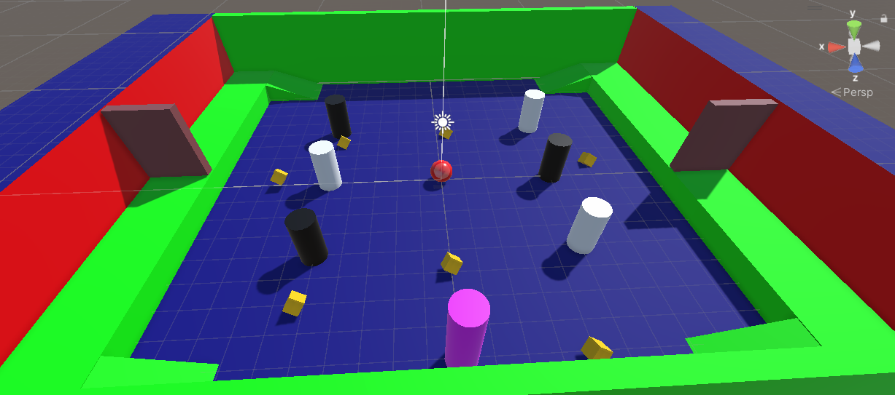

## Cambios y características añadidas
------------------------------------------------------------------------------------
### Creo nuevos obstáculos
He creado varios nuevos objetos en la plataforma, 6 cilindros que están por el medio de la zona y agregan algo de dificultad al juego ya que al intentar coger las monedas es probable que te entorpezcan, en este caso son objetos bastante simples, solo les he cambiado el color, he puesto la mitad blancos y la otra mitad negros.

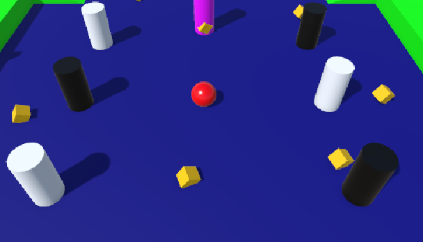

También he añadido 2 nuevos obstáculos 'Puerta' que además muevo mediante un `Animator` controller, los cuales estan en las plataformas laterales a las que se sube por una rampa. Estas puertas también las considero obstáculos ya que se abren y cierran constantemente mediante Animator y si justo pasas cuando se están cerrando chocarías y el enemigo podría alcanzarte, así funcionan:

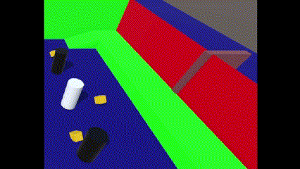

## Creo nuevas interacciones:
------------------------------------------------------------------------------------
### Multiplicación de monedas (velocidad)

Se ha implementado una función para multiplicar la velocidad cada vez que el jugador recoge una moneda. Esto se logra a través del script `PlayerController`, donde he agregado una condición la cual actúa de tal manera que por cada moneda que obtienes tu velocidad se multiplicará x1.5.

Gif de como por cada moneda vas más rápido:

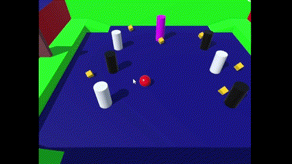

Código para la multiplicación de velocidad y de monedas:
```
if (other.gameObject.CompareTag("PickUp"))
        {
            other.gameObject.SetActive(false);
            count += 1;
            if (count % 3 == 0)
            {
                count *= 2; // Duplica el conteo cada tres monedas recogidas
            }
            speed *= 1.5f; // Aumenta la velocidad con cada moneda recogida
            SetCountText();
        }

```

### Multiplicación de monedas (monedas) 
He establecido un multiplicador que en cuanto llegas a coger 3 monedas tu saldo se multiplica x2 y así constantemnete lo cual propicia que puedas alcanzar 20 monedas cuando por físicas solo hay 8. Esto se implementa en el mismo sitio que el otro multiplicador, el script `PlayerController` sin embargo la recolección de monedas como tal la lleva el script `Rotator`. El código que hace esta nueva interacción posible está en el apartado de arriba ⬆️⬆️⬆️.

### Enemigo añadido

Se ha agregado un enemigo al juego, representado por un cilindro de color rosa que cambiará a color lila si se acerca demasiado al jugador para representar alerta, el enemigo persigue constantemente al jugador, este no parará de perseguirle hasta que consiga acabar el juego. El enemigo se controla mediante un script llamado `EnemigoPerseguir`, donde se implementa la lógica de seguimiento al jugador.

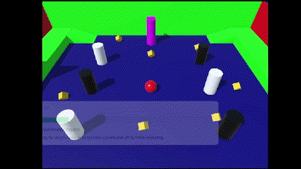

En el código a continuación se puede ver como hago para que el enemigo siga al jugador:
```

            // Calcula la dirección hacia la que debe moverse el enemigo para perseguir al jugador
            Vector3 direccion = (objetivo.position - transform.position).normalized;

            // Calcula el vector de movimiento utilizando la dirección y la velocidad
            Vector3 movimiento = direccion * velocidadMovimiento * Time.deltaTime;

            // Mueve al enemigo hacia el jugador
            transform.Translate(movimiento);
```

### Mejoras Enemigo y Sistema de vida.

He añadido mejoras en la interacción que hay entre el Enemigo y el Jugador, he implementado un Sistema de Vidas y que el enemigo pueda ejercer daño sobre el jugador. Para quitarle una vida el enemigo tendrá que golpear 3 veces al jugador (como se ve en el código de muestra el enemigo puede golpear cada 5 segundos) cuando eso pase el jugador será devuelto a la posición incial en el tablero, tras eliminarlo en 3 ocasiones el jugador se quedará sin vidas y saldrá un mensaje de Derrota. 
Todas estas mejoras están en `EnemigoPerseguir` y en `PlayerHealth`, muestro fragmentos imporantes del código a continuación ⬇️⬇️⬇️.

```
    private void GolpearJugador()
    {
        // Incrementa el contador de golpes
        golpesAlJugador++;

        // Si se alcanzó el límite de golpes, llama al método LoseLife del jugador
        if (golpesAlJugador >= 3)
        {
            PlayerHealth playerHealth = objetivo.GetComponent<PlayerHealth>();
            if (playerHealth != null)
            {
                playerHealth.LoseLife();
            }
            Debug.Log("He perdido una vida!");
        }
    }
```

```
            // Verifica si ha pasado los 5 segundos de cooldown desde el último golpe
            if (Time.time - tiempoUltimoGolpe >= intervaloEntreGolpes)
            {
                // Golpear al jugador
                GolpearJugador();
                tiempoUltimoGolpe = Time.time;
            }
```

```
        // Pérdida de vida en el script PlayerHealth:
        public void LoseLife()
        {
        currentLives--;

        Debug.Log("Has perdido una vida!");

        if (currentLives <= 0)
        {
            Debug.Log("Perdiste!. Ya no te quedan vidas.");
            // Aquí cierras la aplicación o recargas la escena según sea necesario
#if UNITY_EDITOR
            EditorApplication.isPlaying = false; // Detiene la ejecución en el editor de Unity
#else
            Application.Quit(); // Cierra la aplicación cuando se ejecuta como build
#endif
        }
```

### Parpadeo del Jugador y cambio de color del enemigo:

He añadido que cuando el jugador esté muy cerca del Enemigo este empiece a parpadear Rojo-Verde todo el tiempo, cuando se vuelve a separar vuelve a su color original. A la par el enemigo al estar cerca del jugador pasará de su color original (fucsia) a lila. Todo esto lo manejo en los scripts `PlayerController` y `EnemigoPerseguir`.


Codigo que hace posible el parpadeo:
```
void Update() 
     {
          if (animator != null)
          {
               if (Input.GetKey(KeyCode.E))
               {
                    animator.SetTrigger("TrOpen");
                    Debug.Log("E PRESIONADO");
               }
               if (Input.GetKey(KeyCode.Q))
               {
                    animator.SetTrigger("TrClose");
                    Debug.Log("Q PRESIONADO");
               }
          }
          
     }
```

Código que hace posible el cambio de color del enemigo:

```
        if (objetivo != null)
        {
            // Calcula la distancia entre el enemigo y el jugador
            float distanciaAlJugador = Vector3.Distance(transform.position, objetivo.position);

            // Cambia el color del enemigo a morado si está muy cerca del jugador
            if (distanciaAlJugador <= distanciaCambioColor)
            {
                renderer.material.color = colorMorado;
            }
            else
            {
                // Si el jugador está fuera del rango de detección, vuelve al color original
                renderer.material.color = colorOriginal;
            }
```

Coloco ambos código en el `Update` para que siempre se pueda ejecutar en cualquier instancia de nuestro juego.

### Salto y Deformación al Saltar:
Implemento la mecánica del salto, ahora el jugador podrá saltar con un tiempo de cooldown entre salto y salto de 5 segundos. Para ello implemento el codigo siguiente en mi script `PlayerController`:

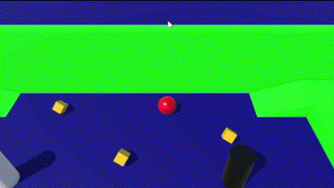
```
    IEnumerator DeformOnJump()
    {
        Vector3 originalScale = transform.localScale;
        Vector3 jumpScale = new Vector3(originalScale.x * 1.2f, originalScale.y * 0.8f, originalScale.z * 1.2f);

        transform.localScale = jumpScale;

        yield return new WaitForSeconds(0.2f);

        while (transform.localScale != originalScale)
        {
            transform.localScale = Vector3.Lerp(transform.localScale, originalScale, Time.deltaTime * 5);
            yield return null;
        }
    }
```

### Puerta con Animator:
Como mencioné en el apartado de los obstáculos, he agregado 2 puertas a las plataformas que hay a cada lado y he configurado que se abran y cierren constantemente para que si te la encuentras cerrada sea un obstáculo. Las dos las gestiono con `animator` que añado desde el menú _inspector_.

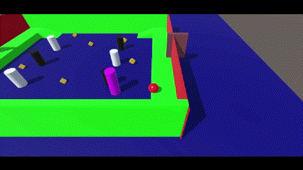
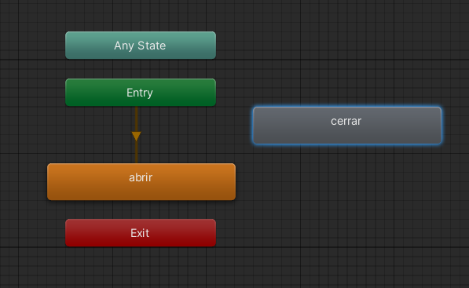

### Elevar pared mediante controles:
He añadido una función para poder elevar una de las paredes mediante el uso de unos controles. En este caso mediante la `Q` puedes elevar la pared `South Wall` y mediante la `E` puedes devolverla a su posición. Todo esto se controla mediante el script `controlPuerta` mediante el código siguiente:

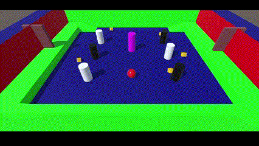
```
    void Update()
    {
        // Verifica si la puerta no está bajando y si el jugador presiona la tecla 'Q'
        if (!puertaBajando && Input.GetKeyDown(KeyCode.Q))
        {
            // Calculamos la nueva posición de la puerta
            Vector3 nuevaPosicion = posicionOriginal + Vector3.up * distanciaSubida;

            // Movemos la puerta a la nueva posición
            transform.position = nuevaPosicion;

            // Actualizamos el estado de la puerta a bajando
            puertaBajando = true;
        }
        // Verifica si la puerta está bajando y si ha vuelto a su posición original
        else if (puertaBajando && transform.position.y <= posicionOriginal.y)
        {
            // Restablecemos el estado de la puerta a no bajando
            puertaBajando = false;
        }

        // Verifica si el jugador presiona la tecla 'E'
        if (Input.GetKeyDown(KeyCode.E))
        {
            // Movemos la puerta de vuelta a su posición original
            transform.position = posicionOriginal;
        }
    }
```

## Texto Victoria, derrota y puntuación:
-----------------------------------------------------------------------------------
El juego tiene un marcador que suma la puntuación que vas alcanzando según las monedas que cojas, cuando llegas a 20 monedas (el máximo que se puede conseguir) ganas y el juego te lo confirma con un mensaje de `Ganaste!!` en el centro de la pantalla,  esto lo hago mediante `TextMeshPro`.

```
    void SetCountText()
    {
        countText.text = "Count: " + count.ToString();
        if (count >= 20) // Si el jugador alcanza 20 monedas, muestra mensaje de victoria
        {
            winTextObject.SetActive(true); // Muestra el mensaje de victoria
        }
    }
```

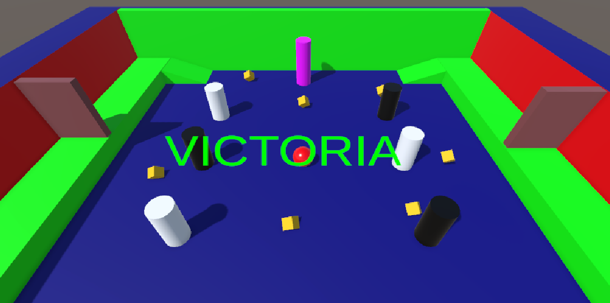

Si el enemigo consigue quitarte las 3 vidas, perderás y se te mostrará el texto de `Has Perdido :(` por pantalla:


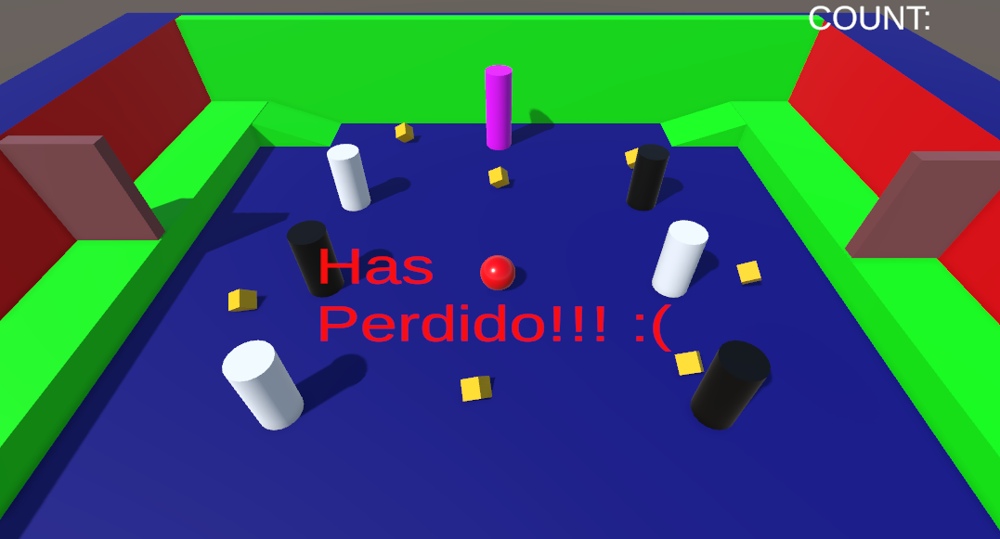

También hice un contador que te dice las monedas que tienes, este comenzará desde 0 cada vez que empieces una nueva partida.


